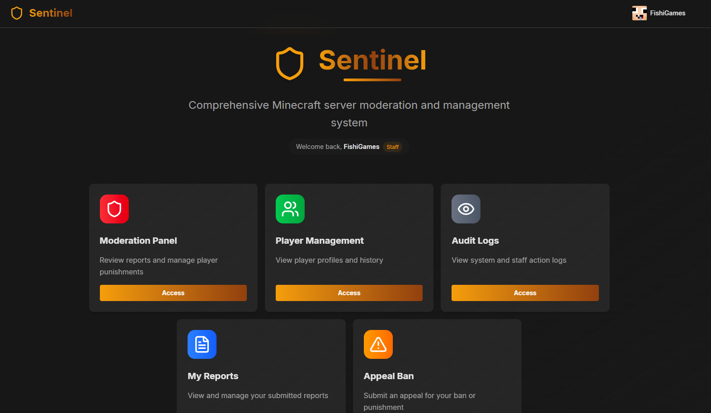

# 🛡️ Sentinel

**A modern Minecraft server moderation system built for efficiency and scale.**


---

## ✨ Features

- 🔐 **Secure Authentication** - JWT-based authentication with role-based access control
- 👤 **Player Management** - Track players with Minecraft UUID integration
- ⚖️ **Punishment System** - Comprehensive moderation tools with escalation templates
- 📊 **Report Management** - Structured reporting system for community moderation
- 🌐 **Modern Web Panel** - Clean, responsive interface built with Next.js and Tailwind CSS
- ⚡ **High Performance** - Rust-powered gRPC backend for maximum efficiency
- 🔄 **Real-time Sync** - Seamless integration with Minecraft server plugins

---

## 👀 First Look



---

## 🚀 Quick Start

### Prerequisites

- **Docker** and **Docker Compose**
- **Rust** (latest stable)
- **Node.js** 18+ with **Bun**
- **PostgreSQL** 18+

### Development Setup

1. **Clone the repository**
   ```bash
   git clone <repository-url>
   cd sentinel
   ```

2. **Start the database**
   ```bash
   cd development
   docker-compose -f docker-compose.dev.yml up -d
   ```

3. **Set up the backend**
   ```bash
   cd backend
   # Copy environment template and configure
   cp .env.example .env
   # Run database migrations
   sqlx migrate run
   # Start the backend server
   cargo run
   ```

4. **Set up the web panel**
   ```bash
   cd webpanel
   # Copy environment template and configure
   cp .env.example .env
   # Install dependencies
   bun install
   # Generate gRPC client code
   bun run prepare
   # Start development server
   bun run dev
   ```

5. **Access the application**
   - Web Panel: http://localhost:3000
   - Backend gRPC: localhost:50051
   - Database: localhost:5432

---

## 📦 Production Deployment

### Using Docker

1. **Build the images**
   ```bash
   ./build-images.sh
   ```

2. **Deploy with Docker Compose**
   ```bash
   docker-compose -f docker-compose.prod.yml up -d
   ```

### Manual Deployment

1. **Backend**
   ```bash
   cd backend
   cargo build --release
   ./target/release/backend
   ```

2. **Frontend**
   ```bash
   cd webpanel
   bun run build
   bun start
   ```

---

## 🛠️ Development

### Database Migrations

```bash
# Create a new migration
sqlx migrate add <migration_name>

# Run migrations
sqlx migrate run

# Revert last migration
sqlx migrate revert
```

---

## 🤝 Contributing

1. Fork the repository
2. Create a feature branch (`git checkout -b feature/amazing-feature`)
3. Commit your changes (`git commit -m 'Add amazing feature'`)
4. Push to the branch (`git push origin feature/amazing-feature`)
5. Open a Pull Request

Please read our [Code of Conduct](CODE_OF_CONDUCT.md) before contributing.

---

## 📄 License

This project is licensed under the MIT License - see the [LICENSE](LICENSE) file for details.

---

## 📜 Code of Conduct

This project adheres to a Code of Conduct to ensure a welcoming environment for all contributors. Please read our [Code of Conduct](CODE_OF_CONDUCT.md) for more information.

---
